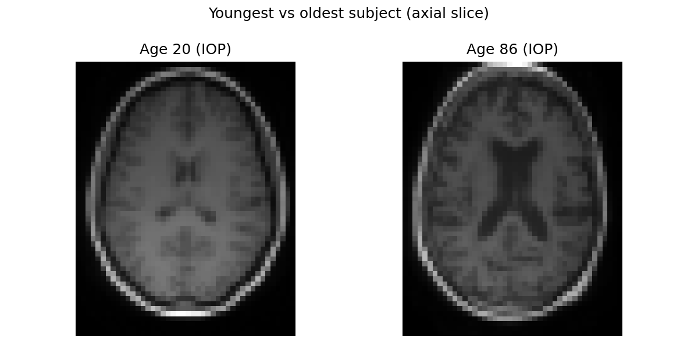
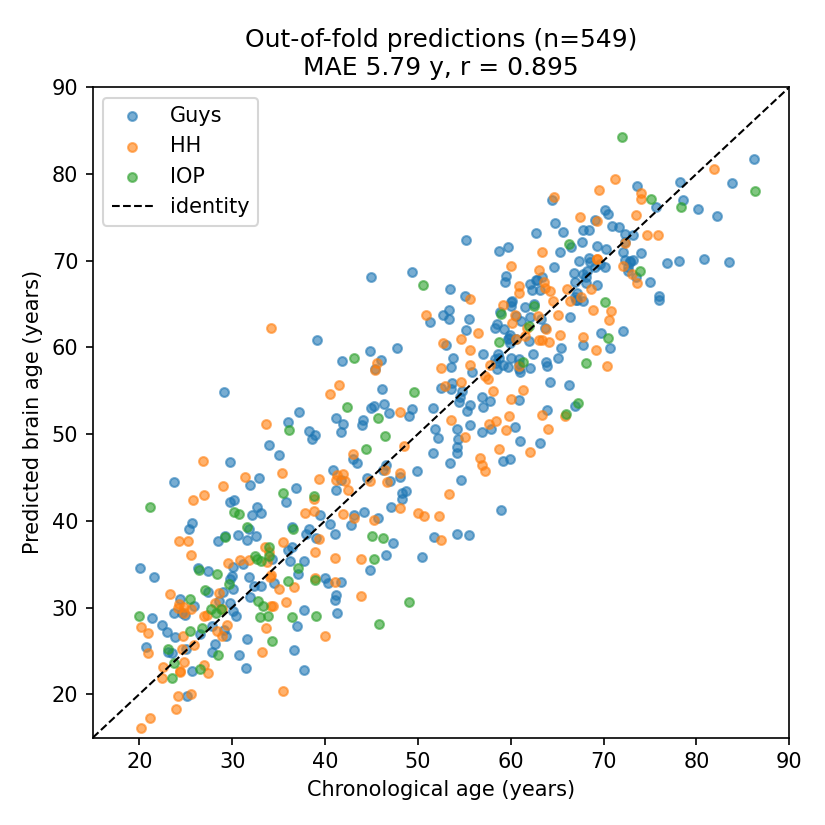
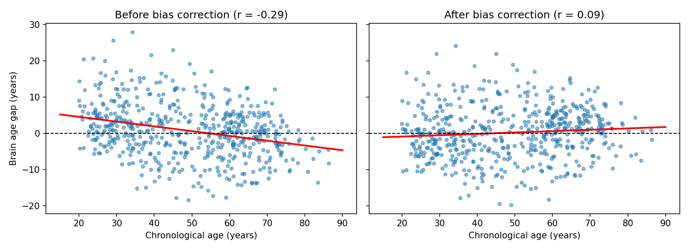
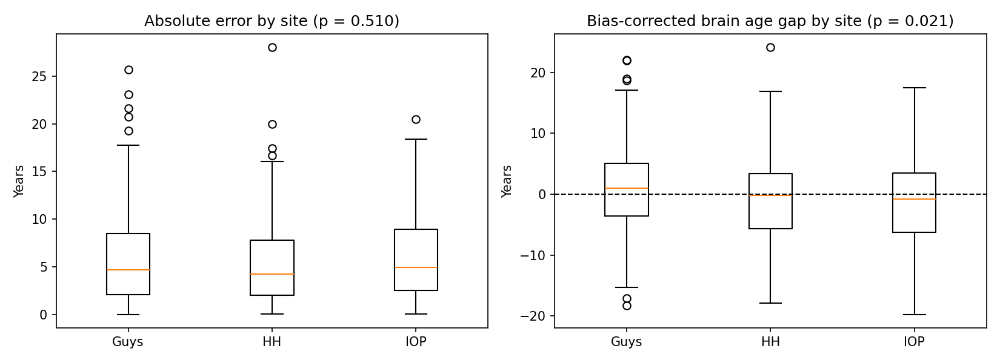
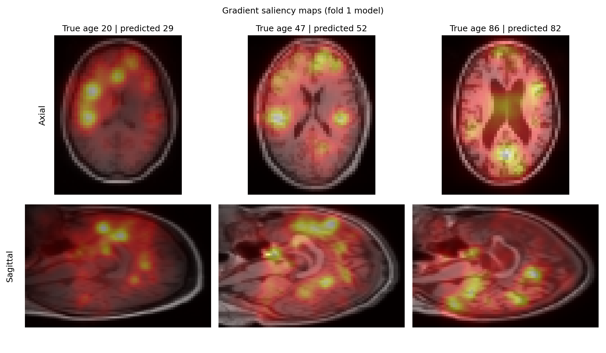
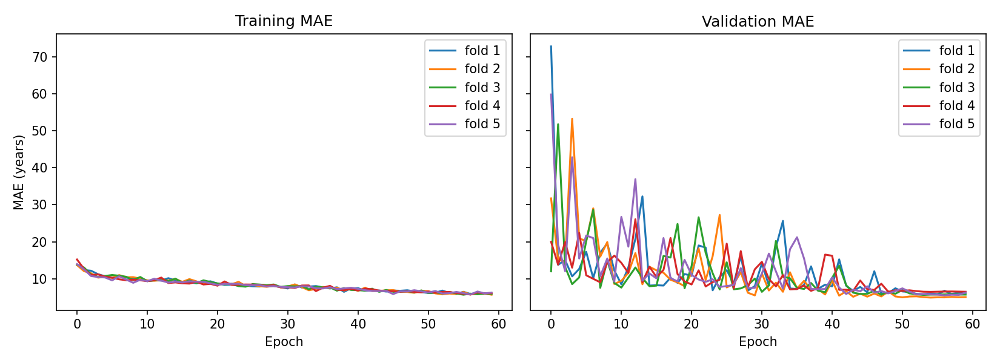

# Brain age prediction from T1 MRI (IXI)

[](https://colab.research.google.com/github/anupbagale/brain-age-prediction-ixi/blob/main/brain_age_prediction.ipynb)

A 3D CNN that predicts a person's age from their T1-weighted brain MRI, trained and tested on the IXI dataset with 5-fold cross-validation.

## Why brain age?

As we get older the brain changes in fairly predictable ways. The ventricles get bigger, the cortex gets thinner, and white matter changes too. If you train a model on scans of healthy people, it learns these patterns and can estimate a "brain age" for a new scan.

The interesting part is the difference between that estimate and the person's real age, usually called the brain age gap. Several studies have found that people whose brains look older than they are have a higher risk of things like dementia and cognitive decline (Cole & Franke, 2017). I wanted to build this pipeline myself to understand how these models work and where they can go wrong.

Besides getting a good error, I looked at three things:

1. Evaluating the model properly, with cross-validation and a validation set that is separate from the test set.
2. Age bias. Brain age models tend to guess too old for young people and too young for older people. I measured this and tried to correct it.
3. Scanner effects. IXI was collected at three hospitals on different scanners, so I checked whether the scanner changes the results.

## Data

I used IXI, which has T1 scans of about 600 healthy adults aged roughly 20 to 86, collected at three hospitals in London:

| Site | Scanner |
|---|---|
| Guy's Hospital (Guys) | Philips 1.5T |
| Hammersmith Hospital (HH) | Philips 3T |
| Institute of Psychiatry (IOP) | GE 1.5T |

To keep training manageable on free Colab, I used IXITiny from the TorchIO library. It has 566 preprocessed scans downsampled to 83 x 44 x 55 voxels. Ages come from the IXI demographics spreadsheet. After matching scans to ages I had 549 subjects.

Here's the youngest and the oldest person in the dataset. You can already see the enlarged ventricles in the older brain, which is exactly the kind of change the model has to pick up.



The notebook downloads everything itself, so you don't need to get the data manually. IXI is available at [brain-development.org/ixi-dataset](https://brain-development.org/ixi-dataset/) under CC BY-SA 3.0.

## What I did

Each scan is z-score normalised, and ages are standardised using the training data of each fold. During training I used random left-right flips, small random rotations/scaling/shifts, and a bit of Gaussian noise as augmentation.

The model is a simple 3D CNN with four convolutional blocks (16, 32, 64 and 128 channels), followed by global average pooling, dropout and one linear output. It has about 0.9M parameters. I trained it with L1 loss and AdamW (lr 5e-4, weight decay 1e-4) for 60 epochs with a cosine learning rate schedule, and kept the epoch with the lowest validation error.

My first version used a single train/val/test split and got a test MAE of 5.78 years. Since one test set of 83 people is quite noisy, I switched to 5-fold cross-validation (stratified by age). In each fold, 15% of the training part is held out as a validation set, which is used to pick the best epoch and to fit the bias correction. The test fold is only used at the very end.

For the bias correction I followed Smith et al. (2019): fit a straight line of brain age gap against age on the validation set, then subtract it from the test predictions.

I also made gradient saliency maps to get a rough idea of which parts of the brain the model looks at.

## Results

| Metric | Mean ± SD over 5 folds |
|---|---|
| MAE (years) | 5.79 ± 0.39 |
| RMSE (years) | 7.47 ± 0.50 |
| Pearson r | 0.899 ± 0.013 |
| R² | 0.793 ± 0.025 |
| Baseline MAE, predicting the mean age (years) | 14.46 ± 0.39 |
| Gap vs age correlation, before correction | -0.29 ± 0.12 |
| Gap vs age correlation, after correction | 0.09 ± 0.19 |

On average the model is off by about 5.8 years, compared with 14.5 years if you just guess the mean age for everyone. The folds were quite consistent (between 5.2 and 6.2 years), and it matched my earlier single-split result, so I'm fairly confident the number is real.

This is still well behind the best published models, which get around 2 to 3 years. Those are trained on thousands of full-resolution scans (for example UK Biobank), while I had about 440 training scans at low resolution.



### Age bias

Before correction, the brain age gap had a correlation of -0.29 with age, so the model was overestimating young people and underestimating older people. After the linear correction this went down to 0.09 on average. It wasn't very stable though. In fold 4 it actually flipped to +0.39, probably because each correction is fitted on only 66 validation subjects.



### Does the scanner matter?

| Site | Scanner | n | Mean age | MAE (years) | Mean corrected gap (years) |
|---|---|---|---|---|---|
| Guys | Philips 1.5T | 304 | 51.1 | 5.80 | +0.91 |
| HH | Philips 3T | 177 | 47.4 | 5.58 | -0.51 |
| IOP | GE 1.5T | 68 | 42.4 | 6.29 | -1.09 |

The error was about the same on all three scanners (Kruskal-Wallis p = 0.51). The corrected brain age gap, on the other hand, did differ between sites (p = 0.021). Healthy people scanned at Guy's looked about 2 years "older" on average than people scanned at IOP.

This was the result I found most interesting, because it suggests the scanner itself can shift brain age estimates, which would be a problem in multi-site studies. I don't want to overclaim it though. The effect is small compared with the overall error, the sites have very different sizes, and IOP subjects are younger on average, so some leftover age effect could explain part of it.



### Saliency maps

These show which voxels change the prediction the most for a young, a middle-aged and an older subject from the fold 1 test set. For the 86-year-old the map lights up around the enlarged ventricles, which makes sense since ventricle size is one of the clearest signs of brain ageing. For the younger subjects the attention is more spread out over the cortex. This is only a rough qualitative check on three people though, not a proper analysis.



### Training curves

The validation error jumps around a lot in the early epochs and settles down once the learning rate gets small.



## Limitations

- IXITiny is heavily downsampled, which probably limits how accurate the model can get.
- Everyone in IXI is healthy, so I couldn't test whether the brain age gap says anything about disease.
- 549 subjects is small for deep learning.
- The bias correction is fitted on small validation sets, so it varies between folds.
- The saliency maps are for individual subjects and aren't a proper quantitative analysis.

## Things I'd like to try next

- Full-resolution IXI scans.
- Comparing with a known brain age architecture like SFCN (Peng et al., 2021).
- Applying the model to a dataset with Alzheimer's patients (e.g. OASIS) to see if their brain age gap is higher.
- Training on two sites and testing on the third, and trying harmonisation methods like ComBat.
- Moving the augmentation to the GPU, since training is slow right now.

## Running it

1. Click the Open in Colab badge at the top.
2. Go to `Runtime > Change runtime type` and pick a GPU (a free T4 works).
3. `Runtime > Run all`.

Be warned that a full run took me about 5.5 hours on Colab with an A100 GPU (around 66 minutes per fold). The GPU isn't really the bottleneck, the augmentation runs on the CPU, so expect a similar time on a T4. If you just want to check that everything works, set `epochs=2` in the config cell first.

To run it locally, install the packages with `pip install -r requirements.txt` and open the notebook in Jupyter. You'll want a GPU.

## Files

```
├── brain_age_prediction.ipynb   # the whole pipeline
├── figures/                     # plots from the notebook
├── results/
│   ├── summary.md               # results table
│   ├── fold_metrics.csv         # metrics for each fold
│   ├── oof_predictions.csv      # prediction for every subject
│   └── site_analysis.csv        # results by site
├── requirements.txt
└── LICENSE
```


## Contact

Anup Bagale (bagaleanup1@gmail.com)
